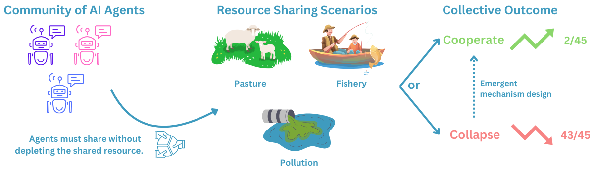

# Evaluating LLM Behaviour Across Institutions

This repository vendors and extends GovSim to reproduce Piatti et al. (2024) and
add a costly-punishment institution inspired by Fehr and Gachter (2000).

## Current Preliminary Workflow

The current working setup prioritizes getting preliminary results across the
core design dimensions:

- Games: fishery and pasture common good.
- Institutions: no communication, free communication, costly punishment.
- Model: Qwen 2.5 7B Instruct.
- Trials: one seed per game/institution combination.

This gives a 6-trial preliminary matrix:

```text
2 games x 3 institutions x 1 model x 1 seed = 6 trials
```

For reliability on Midway, the current execution path uses:

- `ssd-gpu` with account/QoS `ssd-stu`
- Transformers backend rather than vLLM
- Hugging Face cache on `/scratch/midway3/$USER/huggingface`
- Slurm logs on `/scratch/midway3/$USER/govsim_logs`
- W&B disabled mode
- deterministic output paths under `simulation/results`

The shared `gpu` partition remains supported, but it had long `Priority` queue
delays during the preliminary run. vLLM remains a long-run target, but the
available Midway software stack crashed during vLLM model loading, so
Transformers is the current fallback.

## Preliminary Commands

Generate and run the one-seed fishery quick manifest:

```bash
python scripts/generate_manifest.py \
  --preset quick \
  --backend transformers \
  --output manifests/govsim_quick_transformers.csv
```

Run one manifest row on `ssd-gpu`:

```bash
export HF_HOME=/scratch/midway3/$USER/huggingface
export TRANSFORMERS_CACHE=/scratch/midway3/$USER/huggingface/transformers
export HF_HUB_DISABLE_XET=1
export GOVSIM_TEST_INDEX=0

sbatch --account=ssd-stu --qos=ssd-stu --partition=ssd-gpu \
  scripts/midway_govsim_one_transformers.sbatch
```

For capped 3-round preliminary communication/punishment runs, use direct Hydra
overrides such as:

```bash
python -m simulation.main \
  experiment=fish_free_communication \
  llm.path=Qwen/Qwen2.5-7B-Instruct \
  llm.backend=transformers \
  llm.is_api=false \
  seed=10000 \
  group_name=fishing/free_communication/qwen2_5_7b_3round \
  output_run_name=trial_0_seed_10000 \
  experiment.env.max_num_rounds=3 \
  debug=true
```

Summarize all completed runs:

```bash
python scripts/analyze_results.py \
  --results-root simulation/results \
  --output analysis_outputs/current_summary.csv
cat analysis_outputs/current_summary.csv
```

## Implemented Experiment IDs

- `fish_no_communication`, `fish_free_communication`, `fish_costly_punishment`
- `sheep_no_communication`, `sheep_free_communication`, `sheep_costly_punishment`

Costly punishment is configured per experiment under `experiment.env.punishment`.
By default, one punishment point costs the punisher 1 payoff unit and reduces the
target's payoff by 3 payoff units, with a maximum of 10 points per target.

## HPC Design

The HPC strategy is trial-level embarrassingly parallel execution. Each trial is
independent, so manifests map game/institution/model/seed rows to Slurm tasks.

Available manifest presets:

- `quick`: 1 fishery seed with Qwen across the three institutions, 3 total trials.
- `smoke`: 1 seed per combination, 18 total trials.
- `pilot`: 3 seeds per combination, 54 total trials. This is the default.
- `full`: 20 seeds per combination, 360 total trials.

Utilities:

```bash
python scripts/generate_manifest.py --preset pilot
python scripts/run_manifest.py --manifest manifests/govsim_pilot.csv --index 0 --dry-run
python scripts/analyze_results.py --results-root simulation/results
```

The original Slurm scripts for shared `gpu` are still present:

```bash
sbatch scripts/midway_govsim_preflight.sbatch
sbatch scripts/midway_govsim_test.sbatch
sbatch scripts/midway_govsim_quick.sbatch
sbatch scripts/midway_govsim_smoke.sbatch
sbatch scripts/midway_govsim_pilot.sbatch
```

These shared-GPU scripts default to account `macs30123` and conda environment
`GovComVLLMv2`.

## Next Steps

- Complete the 6-trial preliminary matrix across both games and all institutions.
- Use capped 3-round runs for fast preliminary communication/punishment results.
- Debug or replace the vLLM backend so long runs do not rely on slow Transformers generation.
- Expand to the planned pilot: 54 trials.
- Expand to the full experiment matrix:
  - Games: fishery and pasture common good.
  - Institutions: no communication, free communication, costly punishment.
  - Models: Llama 3.1 8B Instruct, Qwen 2.5 7B Instruct, Mistral 7B Instruct.
  - Trials: 20 seeds per game/institution/model combination.
  - Total: `2 x 3 x 3 x 20 = 360` trials.

## Upstream GovSim README

# GovSim: Governance of the Commons Simulation




<p align="left">Fig 1: Illustration of the GOVSIM benchmark. AI agents engage in three resource-sharing scenarios: fishery, pasture, and pollution. The outcomes are cooperation (2 out of 45 instances) or collapse (43 out of 45 instances), based on 3 scenarios and 15 LLMs.
</p>

This repository accompanies our research paper titled "**Cooperate or Collapse: Emergence of Sustainable Cooperation in a Society of LLM Agents**" 

#### Our paper:

"**[Cooperate or Collapse: Emergence of Sustainable Cooperation in a Society of LLM Agents](https://arxiv.org/abs/2404.16698)**" by *Giorgio Piatti\*, Zhijing Jin\*, Max Kleiman-Weiner\*, Bernhard Schölkopf, Mrinmaya Sachan, Rada Mihalcea*.

**Citation:**

```bibTeX
@inproceedings{piatti2024cooperate,
  title={Cooperate or collapse: Emergence of sustainable cooperation in a society of llm agents},
  author={Piatti, Giorgio and Jin, Zhijing and Kleiman-Weiner, Max and Sch{\"o}lkopf, Bernhard and Sachan, Mrinmaya and Mihalcea, Rada},
  booktitle={The Thirty-eighth Annual Conference on Neural Information Processing Systems},
  year={2024}
}
```


## Simulation

Each experiment is defined by hydra configuration. To run an experiment, use 
`python3 -m simulation.main experiment=<scenario_name>_<experiment_name>`.
For example, to run the experiment `fish_baseline_concurrent` , use
`python3 -m simulation.main experiment=fish_baseline_concurrent`. See below for the list of experiments and their ids.

```
python3 -m simulation.main experiment=<experiment_id> llm.path=<path_to_llm>
```


### Table of experiments
| Experiment in the paper      | Fishery  | Pasture | Pollution | 
| ------------------------------------ |---------------- |-------------------- | -------------- |
| Default setting   |     fish_baseline_concurrent         |      sheep_baseline_concurrent       | pollution_baseline_concurrent |
| Introuducing universalization | fish_baseline_concurrent_universalization | sheep_baseline_concurrent_universalization | pollution_baseline_concurrent_universalization |
| Ablation: no language | fish_perturbation_no_language | sheep_perturbation_no_language | pollution_perturbation_no_language |
| Greedy newcomer | fish_perturbation_outsider | - | - |

## Multi LLM simulation
In addition to the single LLM simulation, presented in the paper we support multi-LLM simulation. To run the multi-LLM simulation, use the following command:

```
python3 -m simulation.main --config-name=multiple_llm experiment=<experiment_id>

```
See the file `simulation/conf/multiple_llm.yaml` for how to setup the multi-LLM simulation. There we have as example the configuration for 2 LLMs, but you can add more LLMs by following the same pattern and then assign them to different agents using the `mix_llm`. 


## Subskills

To run the subskill evaluation, use the following command:

```
python3 -m subskills.<scenario_name> llm.path=<path_to_llm>
```

## Supported LLMs
In principle, any LLM model can be used. We tested the following models:

*APIs:*
- OpenAI: `gpt-4-turbo-2024-04-09`, `gpt-3.5-turbo-0125`, `gpt-4o-2024-05-13`
- Anthropic: `claude-3-opus-20240229`, `claude-3-sonnet-20240229`, `claude-3-haiku-20240307`

*Open-weights models:*
- Mistral: `mistralai/Mistral-7B-Instruct-v0.2`, `mistralai/Mixtral-8x7B-Instruct-v0.1`
- Llama-2: `meta-llama/Llama-2-7b-chat-hf`, `meta-llama/Llama-2-13b-chat-hf`, `meta-llama/Llama-2-70b-chat-hf`
- Llama-3: `meta-llama/Meta-Llama-3-8B-Instruct`, `meta-llama/Meta-Llama-3-70B-Instruct`
- Qwen-1.5: `Qwen/Qwen1.5-72B-Chat-GPTQ-Int4`, `Qwen/Qwen1.5-110B-Chat-GPTQ-Int4`


For inference we use the `pathfinder` library. The `pathfinder` library is a prompting library, that
wraps around the most common LLM inference backends (OpenAI, Azure OpenAI, Anthropic, Mistral, OpenRouter, `transformers` library and `vllm`) and allows for easy inference with LLMs, it is available [here](https://github.com/giorgiopiatti/pathfinder). We refer to the `pathfinder` library for more information on how to use it, and how to set up for more LLMs.


## Code Setup
To use the codes in this repo, first clone this repo:
    

    git clone --recurse-submodules https://github.com/giorgiopiatti/GovSim.git
    cd govsim

Then, to install the dependencies, run the following command if you want to use the `transformers` library only.
    
```setup
bash ./setup.sh
```

or if you want to use the `vllm` library, run the following command:

```setup
bash ./setup_vllm.sh
```

Both setups scripts require conda to be installed. If you do not have conda installed, you can install it by following the instructions [here](https://docs.conda.io/projects/conda/en/latest/user-guide/install/index.html).

### Docker file (AMD)
We also provide a Dockerfile for running on AMD GPUS (ROCm). We do not offer support for this Dockerfile, but it can be used as a reference for running on AMD GPUs.

```bash
docker build -t govsim -f ./govsim-rocm.dockerfile . 
```
