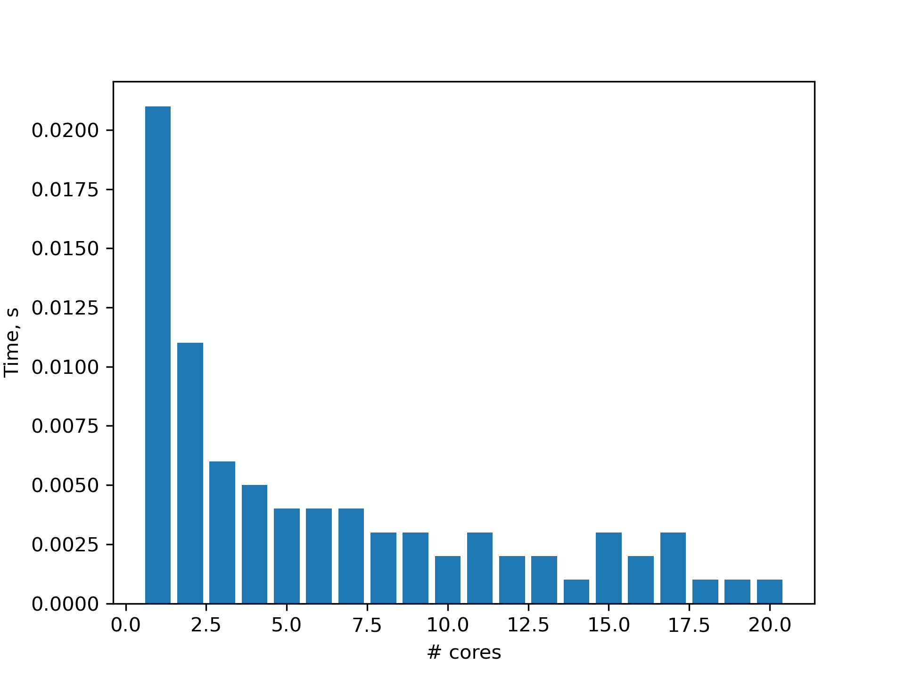
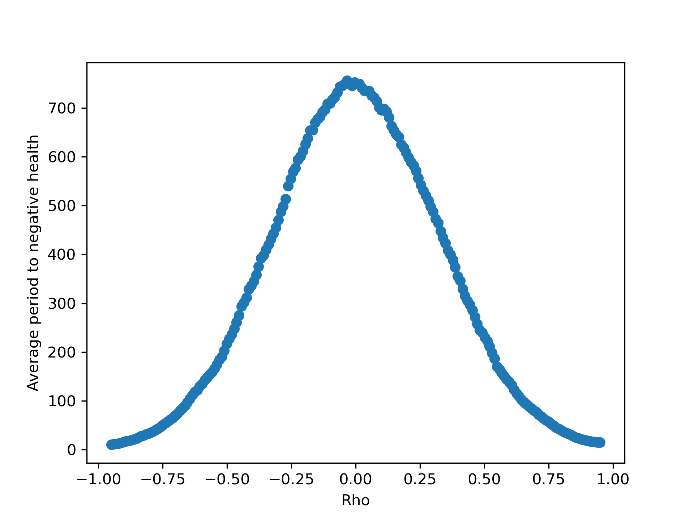

# Assignment 1
Justin Chen
justinchen@uchicago.edu

## Q1
### Q1a
Code: https://github.com/macs30123-s26/a1-isocitrate/blob/main/q1a.py
SBATCH: https://github.com/macs30123-s26/a1-isocitrate/blob/main/q1a.sbatch
ID: 48685647

Time taken for raw Python, JIT, and AOT are: 1.978, 0.133, 0.028 seconds, respectively.

### Q1b
Code: https://github.com/macs30123-s26/a1-isocitrate/blob/main/q1b.py; and https://github.com/macs30123-s26/a1-isocitrate/blob/main/q1b_plot.py
SBATCH: https://github.com/macs30123-s26/a1-isocitrate/blob/main/q1b.sbatch
ID: 48687264

The plot of time vs. number of cores follows. It shows an initially large time decrease as the task gets distributed over more cores, but this quickly plateaus beyond ~5 cores.

### Q1c
There are two main reasons:
1. There is a fundmental limit to parallel speed-up if it gets bottlenecked by a serial task. Here, that is the initial set-up, which is minor but still exists. 
2. There are co-ordination overheads associated with MPI, which gets larger as the number of core increases (which explains why in some instances the time increases with the core count)

## Q2
### Q2a
Code: https://github.com/macs30123-s26/a1-isocitrate/blob/main/q2a.py
SBATCH: https://github.com/macs30123-s26/a1-isocitrate/blob/main/q2a.sbatch
ID: 48685649

Computing optimal rho took 0.06 seconds.

### Q2b
Code: https://github.com/macs30123-s26/a1-isocitrate/blob/main/q2b.py
SBATCH: https://github.com/macs30123-s26/a1-isocitrate/blob/main/q2b.sbatch
ID: 48689911

### Q2c
Optimal rho: -0.03 with average life of 755.76 periods.

## Q3
### Q3a
Code: https://github.com/macs30123-s26/a1-isocitrate/blob/main/q3a.py
SBATCH: https://github.com/macs30123-s26/a1-isocitrate/blob/main/q3a.sbatch
ID: 48689749

Time taken for GPU code: 1.11 seconds
Time taken for CPU code: 0.02 seconds

The resulting image follows:

### Q3b
The GPU implementation takes 55 times as long as the CPU version. While the pixel calculation is parallelised, that was already quite efficient using numpy matrix operations. Instead, we have added overhead, including sending data back and forth from the GPUs and CPU, which accounts for the most of the delay in this relatively small task.

### Q3c
Code: https://github.com/macs30123-s26/a1-isocitrate/blob/main/q3c.py
SBATCH: https://github.com/macs30123-s26/a1-isocitrate/blob/main/q3c.sbatch
ID: 48689750

Time taken for CPU code: 0.998 seconds
Time taken for GPU code (size: 50): 1.725 seconds

Time taken for CPU code: 1.993 seconds
Time taken for GPU code (size: 100): 3.327 seconds

Time taken for CPU code: 2.981 seconds
Time taken for GPU code (size: 150): 4.944 seconds

For the CPU code, the time scales linearly with the task size, as one expects. The GPU code becomes relatively more efficient as the task size increases, going from 55x CPU for size = 1 to 1.73x for size = 50, 1.67x for size = 100, 1.66x for size = 150. The savings from parallel computing starts to become somewhat more favorable against the cost of data transfer, but even at size = 150 the CPU implementation is still faster. Further, the rate of improvement (in GPU time / CPU time) slows and plateaus, suggesting that data transfer speed dis-advantage bottleneck is such that the GPU will never catch up.

