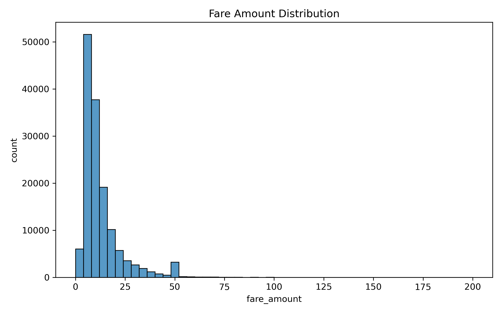
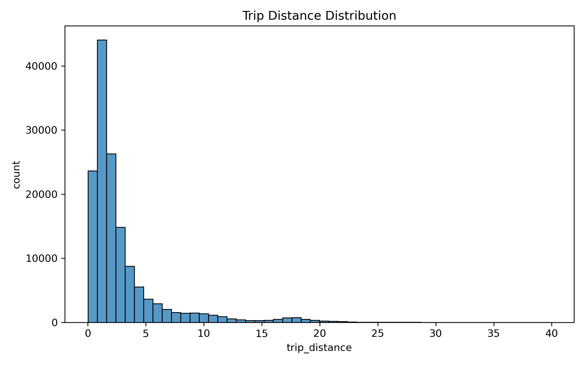
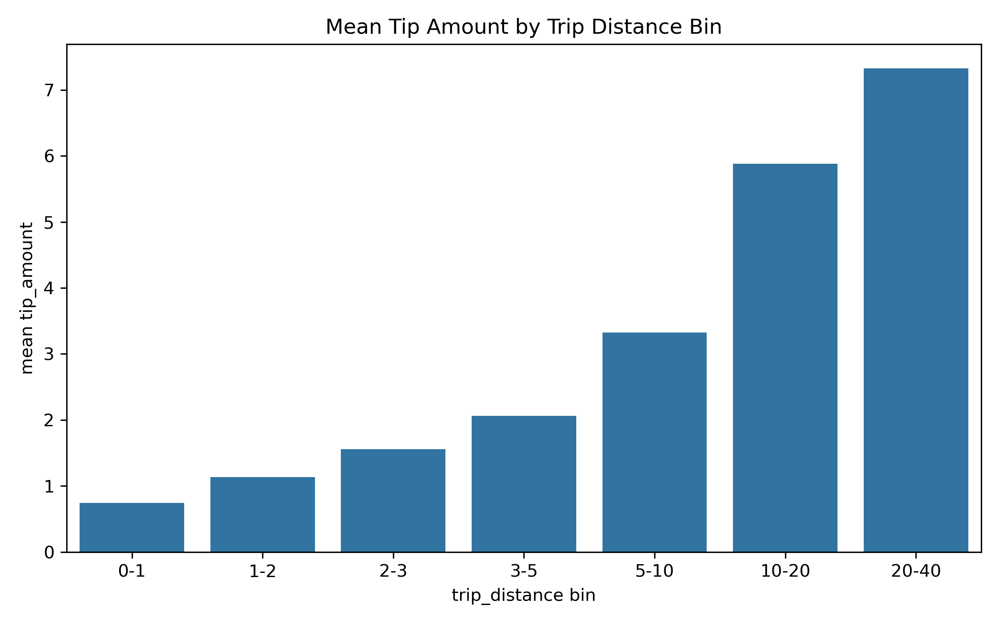
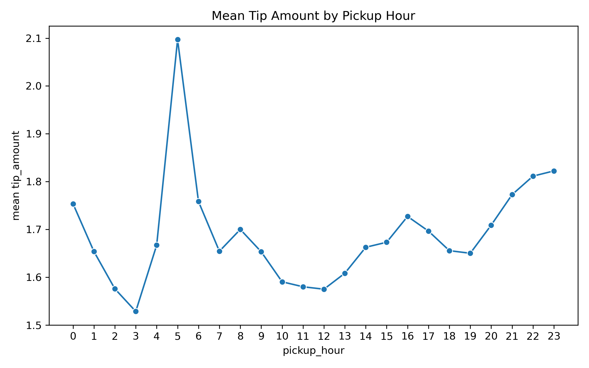
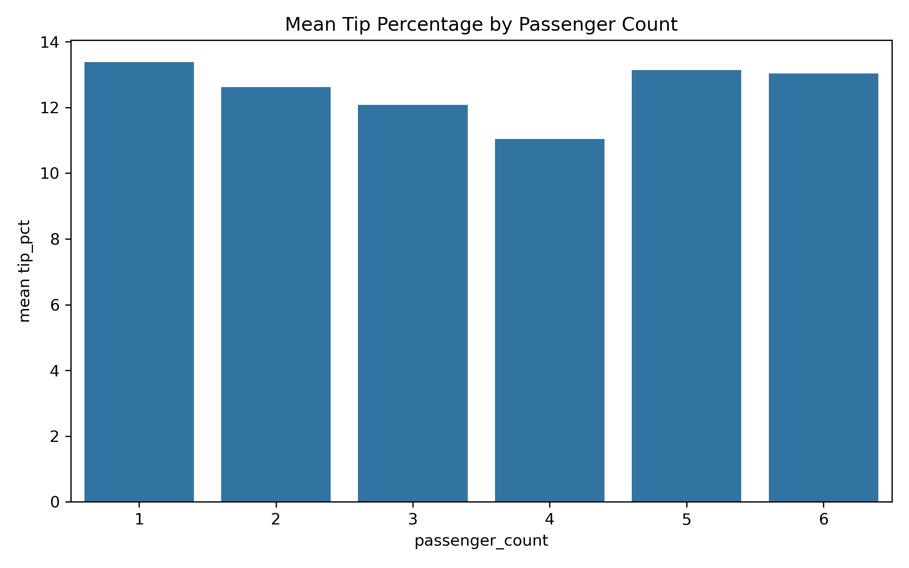

# Assignment 3

## Q1
Job number: 49946484
Code: [q1_figs](q1_figs.py), [q1_load](q1_load.py)

Each of the figures was produced using a 1% sampling of the data, ensuring the workflow is scalable (by adjusting the sampling rate up or down). The expensive filtering and aggregation tasks are done via Dask, which means one does not need to load the full dataset into memory.

- Distribution of fares: This histogram shows the distribution of fares. It is right-skewed, showing a tail of very high fares. The count of extremely low-fare trips is very low, suggesting that perhaps that is not usually even worth it for the drivers to accept.

- Distribution of distances: This histogram shows the distribution of trip distances. It is also right skewed, showing a tail of very long trips. Compared to that of the fare distribution, the number of extremely low-distance trips is proportionally higher, meaning that passengers do request these trips, even though perhaps only at higher prices.

- Tip by distance: This bar chart shows the mean tip amount across seven distance bins. As expected, longer distances result in higher tips, but it increases at a sub-linear rate.

- Tip by time: This chart shows the mean tip amount by the hour of pickup. It has a irregular pattern, with peaks in the morning and afternoon commuting peaks likely driven by weekday commuting trips, as well as late evening peaks likely driven by weekend or visitor trips.

- Tip share by passenger count: This bar chart shows the mean tip (as a share of the total fare) across the number of passengers. Interstingly, this is relatively stable, meaning that passengers do not necessarily tip more because there are more of them (despite the fact that a greater number of passengers might warrant more service or simply have more financial resources).

## Q2
Note that all of Q2 and Q3 relies on helper functions here: [q2_share](q2_share.py)

### Q2a
Job number: 49946591
Code: [q2a](q2a.py)

The five additional features are:
1. 'pickup_borough': a spatial categorical feature intended to capture tipping behaviour by borough (for example, one might expect Manhattan riders to be more generous).
2. 'same_borough', a spatial binary feature intended to capture tipping behaviour by whether the trip has cross boroughs (for example, one might expect a trip that crosses a waterway in New York to generate a higher rate of tips, perhaps because it gives the rider an impression of a more significant trip).
3. 'airport_trip', a binary feature intended to capture whether tipping behaviour differ for trips to/from the airport (for example, airport riders may tip more because they receive help loading/unloading luggage, or that flyers are on average richer than non-flyers).
4. 'pickup_hour', an integer feature meant to bin the datetime feature to explain intra-day time variability
5. 'is_weekend', a binary feature meant to capture whether a trip occured during the weekend (for example, a higher proportion of weekday travellers could be business-related and come out of business accounts, so tips could be more generous)

We also retain the passenger count, fare amount, fare-per-mile, trip duration, and trip distance (binned) features that were already present or previously calculated.

### Q2b
Job number: 49946738
Code: [q2b](q2b.py)

### Q2c
No, like Dask, Spark does not immediately carry out the transformations when the pipeline is defined. Instead, the transformation only occurs when it is needed, i.e. when the appropriate step of the model is run. However, this is done automatically in Spark on runtime because Spark was designed for large-scale SQL and ML tasks, and does not require manual triggers or requests like in Dask (which is a more low level framework).

## Q3
For Q3, I ran two versions: one using the entire dataset throughout, and another randomly sampling 15% for hyperparamter optimization before fitting a final model using the full dataset.

* Full version:
    * Job number: 49929370
    * Code: [q3](q3.py)

* 15% version:
    * Job number: 49934316
    * Code: [q3_subset](q3_subset.py)

The full version has an cross-validation RMSE of 1.92, while the 15% version of 2.01, which is expected since optimizing on a smaller set by definition reduces fit (albeit also with less computing required). Interestingly, while the full version was basically just OLS, the 15% version is a slightly regularised model.

Across both runs, spatial features drive a lot of the tipping behaviour. At the top end, a few pickup boroughs are associated with major tipping increases. Just looking at the full model, trips to Newark Airport, Staten Island (as well as N/A) have the largest absolute values at +$5.1, +$3.3, and +$2.2 respectively. This makes sense as these locations could be considered more "remote" regardless of their distance, for example by requiring the driver to drive further to pick passengers up, thus inducing a larger tip. Counter-intuitively, once borough is controlled for, airport trips are associated with a -$1.1 decrease in tips, which could be just noise, or perhaps that some airport passengers are not familiar with US tipping norms and significantly drag down the average. Later pickup hours are also associated with a +$1.84 increase in tipping, li

Surprisingly, other initially promising factors, like fare amount (which one might guess would be significant if tipping is simply a percentage of the base fare) or trip duration (which is associated with fare amount), or trip_distance. Even acknowledging for the likelihood that they are co-linear, their aggregate effect is still small.  Weekend trips also drive up the tipping only marginally (+$0.01) which is likely statistically insignificant anyway.
